<!-- HEADER: Professional Wave with Gradient -->


<div align="center">

<!-- TYPING ANIMATION: Refined for impact -->


<br/>

<!-- STRATEGIC BADGES: Focused on value proposition -->
[](https://github.com/madanimkhitar22-beep)
[](https://github.com/madanimkhitar22-beep)
[](https://github.com/madanimkhitar22-beep/Mekhitarian-Philosophy-)
[](https://orcid.org/0009-0009-6663-902X)
[](https://github.com/sponsors/madanimkhitar22-beep)

</div>

---

## 🧠 Mission

> **"To engineer digital systems where human consciousness remains the sovereign layer — not an afterthought."**

I design **independent, intent-driven infrastructure** that bridges:
- 🧠 **Human Will** → Machine Execution
- 🔐 **Ethical Sovereignty** → Technical Implementation  
- 🌐 **Decentralized Trust** → Real-World Adoption

*All core research and development is conducted independently from a single mobile device — proving that vision, not resources, defines impact.*

---

## ⚙️ Core Independent Projects

*These are my foundational works — open, modular, and designed for integration.*

<div align="center">

| Project | Description | Status | Key Innovation |
|---------|-------------|--------|---------------|
| **[🧠 madilang](https://github.com/madanimkhitar22-beep/madilang)** | Intent-driven programming language: describe what you want → get production-ready backend code | `v0.3 🧪` | Zero-boilerplate generation with ethical-by-default outputs |
| **[🧠 Sovereign-Cognition-Engine](https://github.com/madanimkhitar22-beep/-Sovereign-Cognition-Engine)** | Ontological AI guardrail: 5 philosophical gates ensure every action aligns with human intent | `v2.0 🚀` | Quantifiable ethics: weights, scores, and authorization logic |
| **[🛡️ Sovereign-DevKit](https://github.com/madanimkhitar22-beep/Sovereign-DevKit)** <br> [](https://www.npmjs.com/package/sovereign-devkit) | Minimalist security utilities: detect & prevent sensitive data leaks with safety-first workflow | `v3.1.0 ✅` | `--dry-run` • `--backup` • `--report` • 35-pattern scanner • Mobile-First CI |
| **[🌟 Mkhitarian Philosophy](https://github.com/madanimkhitar22-beep/Mekhitarian-Philosophy-)** | Foundational framework: intention-based ontology for the digital age | `Concept 📖` | 5 principles bridging consciousness, ethics, and machine logic |

</div>

---
## 🤝 Ecosystem Contributions

*Contributions to the Pi Network ecosystem — built to empower decentralized trust at scale.*

<div align="center">

| Project | Role | Focus Area |
|---------|------|------------|
| **[PiTrust Protocol](https://github.com/madanimkhitar22-beep/PiTrust-Infrastructure-Protocol)** | Architect | Decentralized identity, reputation & trust layer — Mainnet-ready |
| **[PiQuantum-Nexus](https://github.com/madanimkhitar22-beep/PiQuantum-Nexus)** | Lead Researcher | Quantum-secure intelligence layer for post-quantum Web3 |
| **[PiBridge Migration](https://github.com/madanimkhitar22-beep/pibridge-smart-migration)** | Infrastructure Designer | AI-powered KYC & asset migration automation |
| **[PiOS / PiStorage / PiNet-OS](https://github.com/madanimkhitar22-beep)** | Ecosystem Contributor | Decentralized OS primitives & quantum-secure storage |

> 💡 *These projects demonstrate applied sovereignty — but my independent research (above) is where foundational innovation happens.*

</div>

---

## 🛠️ Technical Arsenal

<div align="center">


</div>

---

## 📊 Development Metrics

<div align="center">


</div>

<div align="center">

[](https://github.com/madanimkhitar22-beep)
</div>

---

## 🧬 Engineering Philosophy

```diff
+ Clarity over complexity
+ Intent over scale  
+ Discipline over resources
+ Sovereignty over convenience
```

> *"Architecture is a product of thought — not infrastructure. Constraints refine systems instead of limiting them."*

---

## 🗓️ Current Focus (Q2 2026)

```mermaid
graph LR
    A[madilang v0.4] --> B[Auto-testing + Live Docs]
    C[SCE v2.1] --> D[Plugin System for Custom Gates]
    E[DevKit v3.1] --> F[Multi-language Pattern Support]
    G[Philosophy Book] --> H[First Draft Publication]
    
    style A fill:#1a1a3a,stroke:#00f2ff
    style C fill:#1a1a3a,stroke:#00f2ff
    style E fill:#1a1a3a,stroke:#00f2ff
    style G fill:#1a1a3a,stroke:#a78bfa
```



*All development continues on mobile-first infrastructure. Sponsorship accelerates transition to dedicated workspace.*

---

## 🤝 Support the Independent Mission

<div align="center">

| Tier | Impact | Link |
|------|--------|------|
| ☕ **Coffee** | Keeps the code flowing through long nights | [Buy Me A Coffee](https://buymeacoffee.com/PiTrust) |
| 💻 **Tooling** | Funds cloud testing credits & domain costs | [GitHub Sponsors](https://github.com/sponsors/madanimkhitar22-beep) |
| 🚀 **Freedom** | Enables transition from phone → laptop → full-time research | [Patreon](https://patreon.com/ElMadaniElmkhitar) |

> 🌟 *Even a star on a repository is powerful: it signals interest, attracts collaborators, and validates the mission.*

</div>
---

## 🌐 Connect & Collaborate

<div align="center">

[](https://orcid.org/0009-0009-6663-902X)
[](https://x.com/madaniElmkhitar)
[](https://discord.gg/MbQDsnjD)
[](https://www.linkedin.com/in/el-madani-el-mkhitar-625753173)

</div>

---

<!-- FOOTER: Subtle wave with call to reflection -->


<!-- Hidden meta for SEO / discovery -->
<!-- Keywords: intent-driven programming, ethical AI, decentralized identity, Web3 security, mobile-first development, Morocco tech, Pi Network, conscious computing -->
