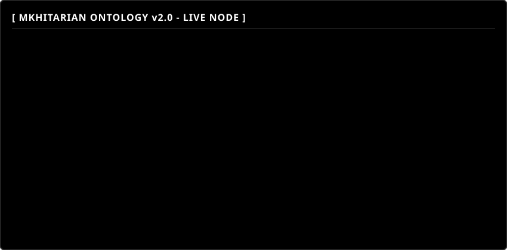

<div align="center">

<!-- ═══════════════ LIVE SOVEREIGN NODE ═══════════════ -->

<sub>⚡ Auto-updated every 6h via GitHub Actions • Powered by Madi.DSL</sub>

<br/><br/>


<code><b>NODE_ID:</b> SOURCE_ARCHITECT</code> • 
<code><b>LOC:</b> TETOUAN, MOROCCO 🇲🇦</code> • 
<code><b>ORCID:</b> 0009-0009-6663-902X</code>

> *"Code is no longer written. It is described.*
> *Human intent is the sovereign layer."*

</div>

---

### ⬛ [ THE SOVEREIGN STACK ]

*Four projects. One living system. Built on the Mkhitarian Philosophy.*

| | PROJECT | NATURE | STATUS |
|:---:|:---|:---|:---|
| 🧠 | **[MadiLang](https://github.com/madanimkhitar22-beep/madilang)** | Intent-driven language (Node.js + Python/FastAPI) | `v0.5.4` • 📦 PyPI |
| 🛡️ | **[Sovereign-Cognition-Engine](https://github.com/madanimkhitar22-beep/-Sovereign-Cognition-Engine)** | AI guardrail with 5 ethical gates | Active |
| 🔒 | **[Sovereign-DevKit](https://github.com/madanimkhitar22-beep/Sovereign-DevKit)** | Intent-first secret scanner | `v3.1.0` |
| 🌊 | **[Fayd Protocol](https://github.com/madanimkhitar22-beep/fayd-protocol)** | Verifiable decentralized compute (Rust/WASM) | `Phase 0` |

> 💡 **Philosophy in Motion:** Each project embodies *Tawazun al-Wujud* (balance), *Niyya Khaliqa* (creative intent), and *Al-Satr* (sacred privacy). Not separate tools — organs of one sovereign organism.

---

### 🔷 [ RESEARCH CONTRIBUTIONS ]

*Experimental proposals submitted to the Pi Network ecosystem for community consideration.*

These are **conceptual architectures** exploring quantum-secure, AI-powered infrastructure patterns. Not deployed to mainnet — offered as open research for peer review and potential adoption.

| PROPOSAL | FOCUS AREA |
| :--- | :--- |
| **[PiTrust](https://github.com/madanimkhitar22-beep/PiTrust-Infrastructure-Protocol)** | Decentralized identity & reputation attestation |
| **[PiNet-OS](https://github.com/madanimkhitar22-beep/PiNet-OS)** | Quantum-secure operating layer (AES-512 + ZTNA) |
| **[PiStorage](https://github.com/madanimkhitar22-beep/PiStorage)** | Encrypted distributed storage model |
| **[PiBridge](https://github.com/madanimkhitar22-beep/pibridge-smart-migration)** | Cross-chain migration architecture |
| **[PiQuantum-Nexus](https://github.com/madanimkhitar22-beep/PiQuantum-Nexus)** | Post-quantum cognitive layer (simulation only) |

> 📜 All proposals align with PiOS governance and are open for community critique, improvement, or adoption.

---

### 📐 [ DIRECTIVES ]

```ascii
      ___          ___          ___          ___     
     /\  \        /\  \        /\  \        /\  \    
    /::\  \      /::\  \      /::\  \      /::\  \   
   /:/\:\  \    /:/\:\  \    /:/\:\  \    /:/\:\  \  
  /::\~\:\  \  /::\~\:\  \  /::\~\:\  \  /::\~\:\  \ 
 /:/\:\ \:\__\/:/\:\ \:\__\/:/\:\ \:\__\/:/\:\ \:\__\
 \/__\:\/:/  /\/__\:\/:/  /\/__\:\/:/  /\/__\:\/:/  /
      \::/  /      \::/  /      \::/  /      \::/  /  
      /:/  /       /:/  /       /:/  /       /:/  /   
      \/__/        \/__/        \/__/        \/__/    
```

- **01** Execution must be mathematically provable.
- **02** No external dependencies. No opaque layers.
- **03** The machine serves the will. Code is execution of conscious purpose.
- **04** Constraints refine systems — discipline is a virtue.
- **05** Privacy is sacred. Security is embedded, not added.

---

### 📡 [ CONNECT ]

<div align="center">

[ `[ ORCID ]`](https://orcid.org/0009-0009-6663-902X) • 
[ `[ X ]`](https://x.com/madaniElmkhitar) • 
[ `[ DEV.TO ]`](https://dev.to/madanimkhitar22beep) • 
[ `[ OPENTALENT ]`](https://www.opentalent.in/el-madani-el-mkhitar-madani004) • 
[ `[ EMAIL ]`](mailto:madani004@proton.me)

<br/>

[ `[ ☕ COFFEE ]`](https://buymeacoffee.com/PiTrust) • 
[ `[ 💻 SPONSOR ]`](https://github.com/sponsors/madanimkhitar22-beep) • 
[ `[ 🚀 PATREON ]`](https://patreon.com/ElMadaniElmkhitar)

<br/>

<a href="https://github.com/madanimkhitar22-beep">
  
  
</a>

<br/><br/>

**"Every line is a choice. Make it absolute."**

`madani004` // `Tetouan` // `Morocco` // `In the Name of the Creator, We Code with Intent`

</div>
